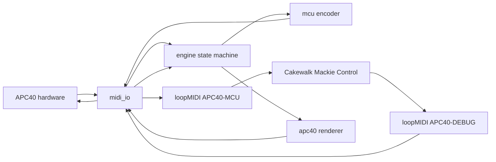

# APC40 to Cakewalk by BandLab: Python Implementation Plan

## Why pivot

The MIDIMonster/Lua prototype proved the concept and produced a complete protocol
reference, but hit a class of platform limitations that are costly to work around:

- `winmidi` cannot emit a real Note Off (it sends Note On velocity 0), which caused
  double-toggles in Cakewalk.
- Output values are de-duplicated, so repeated identical presses are dropped.
- A single `default-handler` does not reliably provide the input channel name.
- Interval/show timing is opaque and the startup show sometimes never completes.
- **Intermittent feedback loss:** MIDI-OX receives Cakewalk's feedback on `APC40-DEBUG`
  while MIDIMonster does not, indicating loopMIDI reader starvation.

A small Python application removes all of these: we own the MIDI ports directly, send
exactly the bytes we intend, and can log and test everything.

## What we keep

All protocol and design work is reused:

- [`docs/apc40-communications-protocol.md`](../docs/apc40-communications-protocol.md) - full Akai protocol
- [`docs/apc40-output-reference.md`](../docs/apc40-output-reference.md) - APC40 LED/ring authority
- [`docs/mcu-mapping.md`](../docs/mcu-mapping.md) - MCU protocol and mapping
- [`docs/cakewalk-command-matrix.md`](../docs/cakewalk-command-matrix.md) - MCU vs keyboard bridging
- [`docs/setup-loopmidi-and-cakewalk.md`](../docs/setup-loopmidi-and-cakewalk.md) - port topology and Cakewalk setup
- The validated control mappings and knob-mode behavior from the Lua engine.

## Architecture



- One process owns the physical `Akai APC40` (input and output).
- One process owns `APC40-MCU` (write) and `APC40-DEBUG` (read).
- No other application may open these ports while the app runs.

## Port topology (unchanged)

| Port | Direction | Used by |
|---|---|---|
| `Akai APC40` | read + write | this app only |
| `APC40-MCU` | app -> Cakewalk | app writes; Cakewalk surface In Port |
| `APC40-DEBUG` | Cakewalk -> app | Cakewalk surface Out Port; app reads |

## Module layout

```text
apc40sonar/
  __main__.py        entry point and run loop
  config.py          load and validate config/apc40-sonar.yaml
  midi_io.py         rtmidi port open/close, send/receive, device listing
  apc40.py           APC40 protocol: notes, colors, ring positions, ring styles
  mcu.py             MCU encode (buttons, faders, vpots, rings) and decode
  engine.py          state machine: knob modes, banks, grid modes, dispatch
  lightshow.py       startup lightshow (ported from the Lua show)
  logging_setup.py   file and console logging
config/
  apc40-sonar.yaml   ports, options, and the control mapping
tests/
  test_apc40.py      APC40 message encoding
  test_mcu.py        MCU encode/decode round trips
  test_engine.py     knob modes, pan centering, feedback rendering
requirements.txt     python-rtmidi, PyYAML
run-apc40-sonar.cmd  launcher
```

## Key behaviors to implement

### MCU output (app to Cakewalk)

- Buttons: real **Note On velocity 127** on press and **real Note Off (0x80)** on
  release. This fixes the double-toggle and needs no velocity hacks.
- Faders: Pitch Bend, 14-bit, channels 0-7.
- V-pots: relative CC 16-23, single message carrying the delta
  (`0x01`-`0x3F` positive, `0x41`-`0x7F` negative).
- Assign buttons: notes 40-45 (Track/Send/Pan/Plug-in/EQ/Instrument).

### MCU input (Cakewalk to app)

- Note feedback (0-119) -> APC40 strip LEDs and transport LEDs.
- V-pot ring feedback (CC 48-55) -> APC40 Track Control rings.
- Fader feedback (Pitch Bend) -> ignored (no motorized faders).

### APC40 output

- Strip LEDs: notes 48-52 per track channel.
- Clip grid: notes 53-57 per track channel, color/state values 0-6.
- Utility row, Master, Scenes, transport: notes 58-101 on channel 0.
- Track Control ring position: CC 48-55; ring style: CC 56-63.
- Device Control ring position: CC 16-23; ring style: CC 24-31.

### Knob modes

- Pan (note 87), Send A (88), Send B (89), Send C (90).
- Selecting a mode: light only that button, clear the others, set the ring style
  (Pan = 3, Send = 2), and for Pan center the rings at 63.
- Send the matching MCU Assign message.

### Startup lightshow

- Port the validated Lua show, then render the baseline state and select Pan mode.

## Configuration

`config/apc40-sonar.yaml` holds port names, options, and the mapping so behavior can be
changed without editing code.

## Testing

- Unit tests for APC40 and MCU encoding (no hardware needed).
- A `--list-ports` mode to print available MIDI devices.
- A `--monitor` mode to print all incoming APC40 and feedback messages.
- A `--no-show` mode to skip the lightshow during development.

## Migration steps

1. Scaffold the package, config, requirements, and launcher.
2. Implement `midi_io` and `--list-ports`; verify ports open.
3. Implement `apc40` and `mcu` with unit tests.
4. Implement `engine` for the mixer core (faders, strip buttons, transport, knob modes).
5. Implement feedback rendering (strip LEDs, rings, transport).
6. Port the startup lightshow.
7. Validate end-to-end with Cakewalk.
8. Add grid modes, device/plug-in control, and global commands.
9. Polish: recovery, logging, docs, and the launcher.

## Open questions

- Python availability and version on the target machine.
- Whether to use `python-rtmidi` directly or `mido` on top of it.
- Whether to keep MIDIMonster for anything (currently: no).
